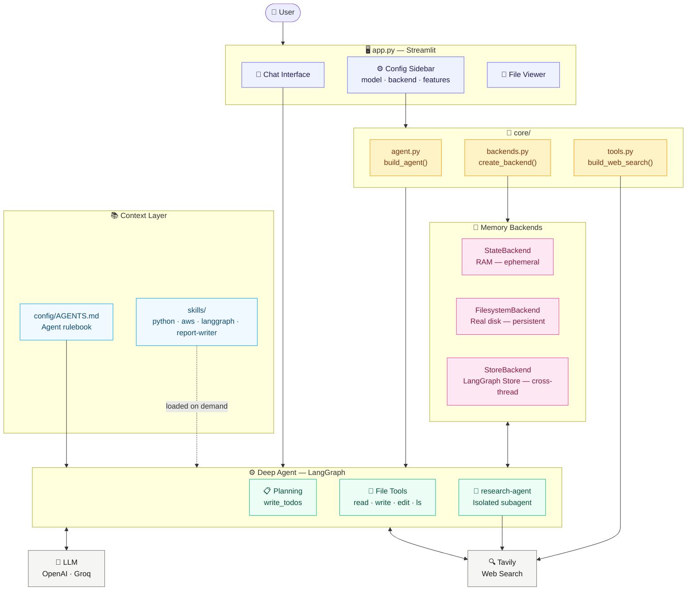
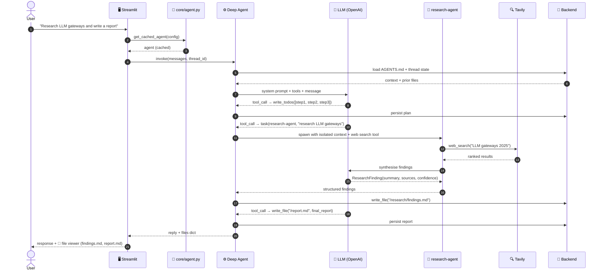
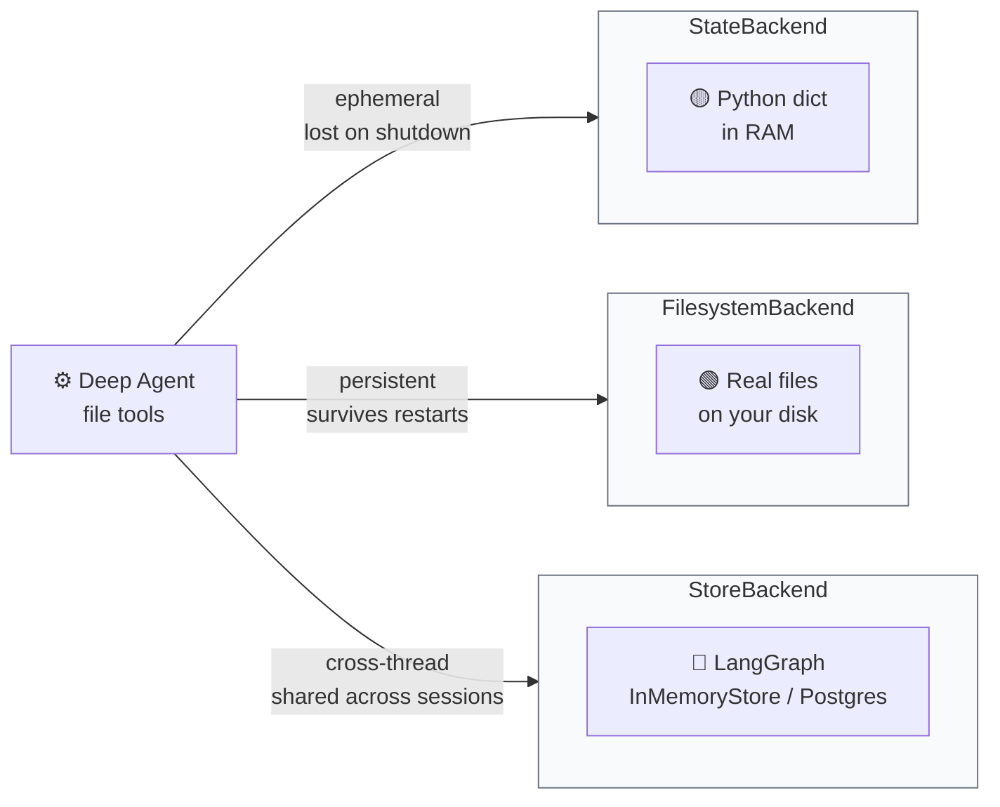
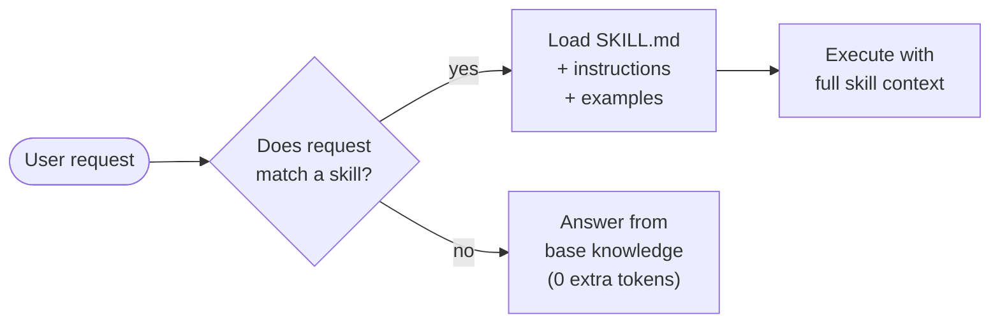

# 🤖 Deep Agent Chatbot — LangGraph + deepagents

> A Streamlit conversational interface that wires every feature of the **deepagents** library into one runnable app — planning, context engineering, subagent delegation, swappable memory backends, and on-demand skills.

[](https://www.python.org/downloads/)
[](https://pypi.org/project/deepagents/)
[](https://github.com/langchain-ai/langgraph)
[](https://deepagent-langchain-claude-replica.streamlit.app/)
[](LICENSE)

**🚀 Live demo: [deepagent-langchain-claude-replica.streamlit.app](https://deepagent-langchain-claude-replica.streamlit.app/)**

---

## Overview

This project turns the deepagents notebook demos into a **production-shaped chatbot** you can run, configure, and extend. A single agent built on LangGraph can:

- **Plan** complex tasks before executing them (todo-list tool)
- **Offload memory** to files rather than stuffing everything into the context window
- **Delegate** isolated research subtasks to a specialised subagent
- **Persist work** across sessions using one of three swappable storage backends
- **Load expertise on-demand** from domain skill files — only when relevant

The same agent logic powers all three backends and any supported LLM — swap them at runtime from the sidebar without changing a line of code.

---

## 🏗️ Architecture

### System overview



### Request lifecycle



### The three memory backends

The agent's virtual filesystem can live in three different places. The **agent code never changes** — only the backend.



### How skills work (progressive disclosure)



Skills are **never pre-loaded**. A Python question pulls `skills/python/` into context; an AWS question pulls `skills/aws/`. Any other topic skips all skill files entirely — keeping token usage lean.

### Tech stack

| Layer | Technology | Role |
|:--|:--|:--|
| 🧠 **Runtime** | Python 3.13 | Language runtime |
| ⚙️ **Agent framework** | deepagents 0.6.8 | Planning, file system, subagents |
| 🔗 **State machine** | LangGraph 1.2+ | Agent graph, checkpointing, stores |
| 🤖 **LLM** | OpenAI + LangChain | Tool-calling orchestration |
| ⚡ **Fast inference** | Groq (Qwen3-32b) | Low-latency subagent model |
| 🖥️ **UI** | Streamlit | Chat interface and config sidebar |
| 🔍 **Web search** | Tavily | Real-time internet search tool |
| 📦 **Tooling** | uv · python-dotenv | Dependency management, secrets |

---

## 📋 Feature Catalog

### Planning — `write_todos`

Before tackling any multi-step task the agent writes an explicit todo list with statuses (`pending → in_progress → completed`). This is the mechanism that lets it stay on track over long, complex tasks without losing context.

```
✅ Step 1: Search the web for LLM gateway comparisons
✅ Step 2: Write findings to /research/findings.md
🔄 Step 3: Draft report from findings
⬜ Step 4: Finalise and return answer
```

### Context Engineering — `config/AGENTS.md`

The agent's rulebook is loaded into its context at every session start. It defines who the agent is, what tools it has, and how it should behave — without hard-coding any of it into Python.

```
config/AGENTS.md  →  "Plan first. Offload bulky content to files.
                      Delegate research to subagents. Cite sources."
```

Editing `AGENTS.md` changes agent behaviour across all backends and models instantly.

### Subagents — `research-agent`

The main agent can delegate isolated research tasks to a child agent. The subagent gets:

| Property | Value |
|:--|:--|
| **Model** | `groq:qwen/qwen3-32b` (fast, cheap) |
| **Context** | Fresh — no parent conversation bleed |
| **Tools** | Tavily web search |
| **Output** | Plain text or `ResearchFinding` Pydantic schema |

Only the subagent's final answer returns to the parent — raw search results never pollute the main context window.

### Memory Backends

| Backend | Storage | Survives shutdown | Cross-thread | Best for |
|:--|:--|:--:|:--:|:--|
| `StateBackend` | Python dict (RAM) | ❌ | ❌ | Quick demos, throwaway runs |
| `FilesystemBackend` | Real files on disk | ✅ | ✅ | Local dev, editing real project files |
| `StoreBackend` | LangGraph store | ✅ (with Postgres) | ✅ | Multi-user apps, cloud deployment |

### Skills — `skills/`

| Skill | Triggers when… | Files |
|:--|:--|:--|
| `python` | User asks about Python code, errors, best practices | `SKILL.md`, `instructions.md`, `examples.md` |
| `aws` | User asks about AWS services, deployment, IAM | `SKILL.md`, `instructions.md`, `examples.md` |
| `langgraph` | User asks about LangGraph graphs, nodes, state | `SKILL.md`, `instructions.md`, `examples.md` |
| `report-writer` | User asks for a structured report or document | `SKILL.md`, `instructions.md`, `examples.md` |

---

## Quickstart

Requires **Python 3.13+** and API keys for OpenAI and Tavily.
[`uv`](https://docs.astral.sh/uv/) is recommended.

```bash
# 1. Clone
git clone https://github.com/Amith-Ganta/Deepagent-langchain.git
cd Deepagent-langchain

# 2. Configure secrets
cp .env.example .env
# edit .env — add OPENAI_API_KEY, GROQ_API_KEY, TAVILY_API_KEY

# 3. Install dependencies
pip install -r requirements.txt
# or with uv:
uv sync

# 4. Run
streamlit run app.py
```

Open **[http://localhost:8501](http://localhost:8501)**

> Get keys at: [OpenAI](https://platform.openai.com) · [Groq](https://console.groq.com) · [Tavily](https://tavily.com)

---

## Configuration

| Variable | Required | Default | Purpose |
|:--|:--:|:--|:--|
| `OPENAI_API_KEY` | ✅ | — | Authenticates OpenAI model calls |
| `GROQ_API_KEY` | ⚠️ | — | Required only when subagent uses Groq |
| `TAVILY_API_KEY` | ⚠️ | — | Required for web search tool; disabled if absent |

All variables are read from `.env` via `python-dotenv`. The app degrades gracefully — if `TAVILY_API_KEY` is missing, web search is disabled and clearly flagged in the UI.

---

## Project Structure

```
.
├── app.py                          # Streamlit entry point — UI only
├── core/
│   ├── __init__.py
│   ├── agent.py                    # build_agent(), subagents, skills hint
│   ├── backends.py                 # StateBackend / FilesystemBackend / StoreBackend
│   └── tools.py                    # Tavily web_search factory
├── config/
│   └── AGENTS.md                   # Agent rulebook — loaded at every session start
├── skills/
│   ├── python/                     # Python expert skill
│   ├── aws/                        # AWS expert skill
│   ├── langgraph/                  # LangGraph expert skill
│   └── report-writer/              # Report writing skill
├── notebooks/
│   ├── 01_basic_deep_agent.ipynb   # Create your first deep agent
│   ├── 02_context_engineering.ipynb # AGENTS.md, system prompts, MemorySaver
│   ├── 03_backends.ipynb           # All three backends with live demos
│   └── 04_subagents.ipynb          # Sync subagents and structured output
├── .env.example                    # API key template — safe to commit
├── .gitattributes                  # LF line ending normalisation
├── .gitignore                      # .env and venv excluded
├── pyproject.toml                  # Project metadata and dependencies
└── requirements.txt                # Pinned deps for pip installs
```

---

## Notebooks

The `notebooks/` directory is a self-contained learning path — each notebook runs independently and builds on the previous one.

| Notebook | Concept | Key takeaway |
|:--|:--|:--|
| `01_basic_deep_agent` | Agent basics | How `create_deep_agent` differs from a plain LLM call |
| `02_context_engineering` | AGENTS.md + MemorySaver | Loading durable instructions and persisting conversation state |
| `03_backends` | Storage backends | Same agent, three different durability guarantees |
| `04_subagents` | Subagent delegation | Isolated context, structured output, Groq for fast inference |

---

## Design Decisions

**`core/` has zero Streamlit imports.**
The agent-building logic in `core/` is a plain Python package. It can be imported into a FastAPI endpoint, a CLI, or a test suite without pulling in any UI dependency.

**`@st.cache_resource` keyed on all config parameters.**
Building an agent is expensive (model init, backend wiring, subagent setup). Streamlit reruns on every interaction, so the agent is built once and reused until the user changes a config option — at which point Streamlit's cache invalidation triggers a clean rebuild automatically.

**AGENTS.md over hard-coded system prompts.**
All agent personality and operating rules live in `config/AGENTS.md` — a versioned, editable text file. Changing agent behaviour requires editing markdown, not Python. This is the same pattern used by Claude Code and Manus.

**Skills as progressive disclosure.**
Loading all four skill files on every turn would waste tokens on irrelevant content. Instead, the agent is told the skills exist via a one-line system prompt hint and fetches only the relevant `SKILL.md` when the user's request matches that domain.

---

## License

Released under the [MIT License](LICENSE). © 2026 Amith Ganta.
